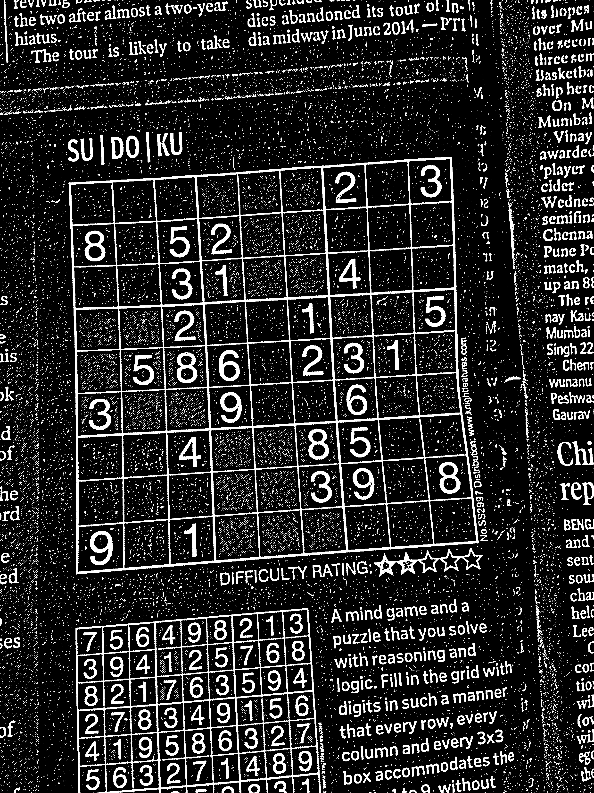
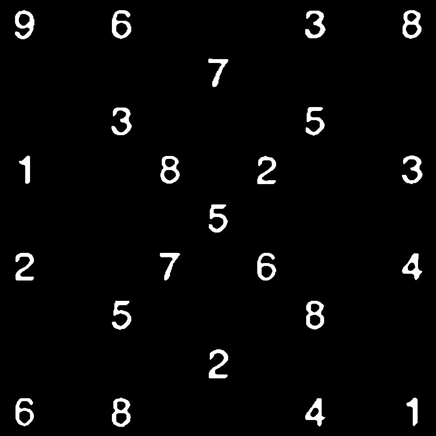
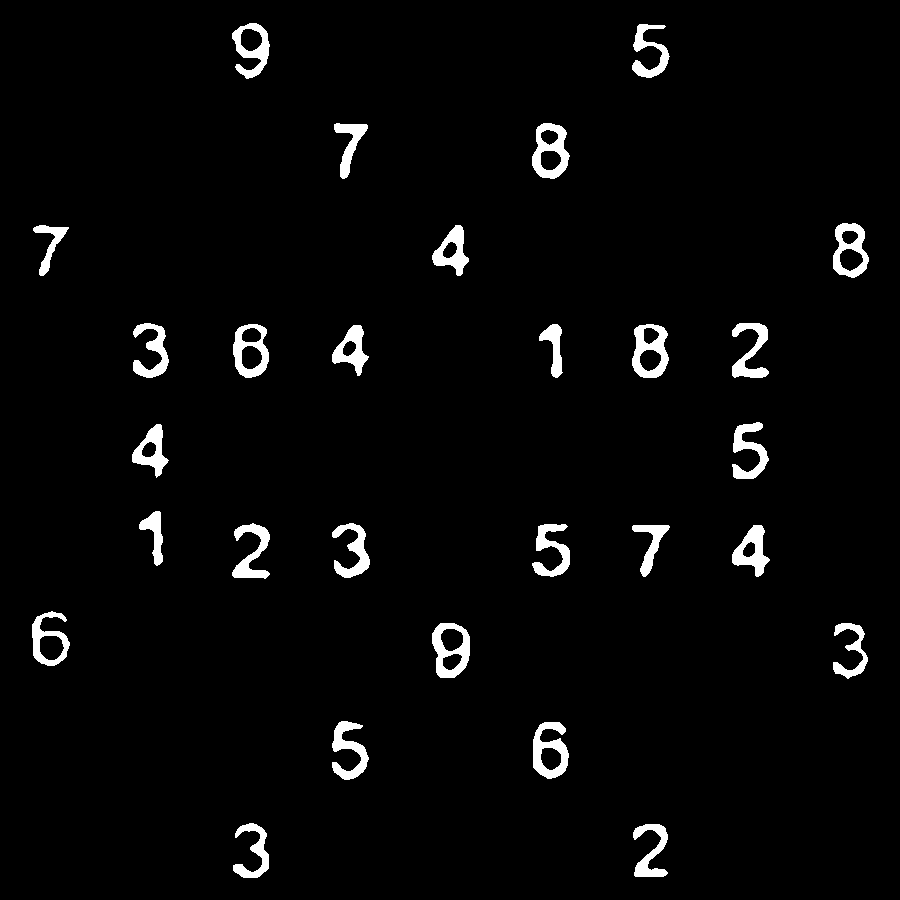

# Sudoku Grabber
## Elaborato per il Corso di Analisi Immagini e Analisi Dati - parte di Analisi Immagini
### Carlo Emilio Montanari
#### a.a. 2017/18, Università di Bologna - Corso di Laurea Magistrale in Applied Physics

## Scopo del progetto

Il presente lavoro si pone come obiettivo l'enhancing e la sogliatura di un Sudoku estratto da una fotografia generica, con lo scopo di restituire una serie di 81 immagini binarie quadrate (le 81 celle del Sudoku) contenenti al centro l'eventuale cifra della cella (o, se non presente, una cella vuota).

Si desidera che questo output finale sia il più adatto possibile ad una successiva analisi per il riconoscimento della cifra (tale fase sarà argomento della relazione di Analisi Dati).

## Dipendenze del progetto

Il progetto in linguaggio Python3 richiede le seguenti librerie:

1. `numpy`
2. `cv2`

## Esecuzione del progetto

Per eseguire il progetto è sufficiente eseguire lo script `main.py`, avendo cura di specificare all'interno del file il percorso delle immagini del Sudoku da analizzare. Lo script caricherà quindi le classi dagli script secondari ed eseguirà l'analisi stampando tutte le immagini intermedie del processo nello stesso percorso dell'input, di modo che sia possibile osservare i vari step dell'algoritmo.

Il risultato finale sarà una composizione delle 81 immagini binarie in quello che è un "Sudoku binario" ottimizzato per l'analisi.

Di default, lo script analizza tutte le immagini contenute nella cartella `img`.

## L'algoritmo in breve

La struttura dell'algoritmo, riassunta nei suoi punti fondamentali, è la seguente:

1. Conversione dell'immagine in scala di grigi, preprocessing e Thresholding.
2. Primo ritaglio approssimativo del Sudoku.
3. Ottenimento degli angoli della cornice del Sudoku.
4. Warp perspective a partire dai quattro angoli ottenuti del Sudoku.
5. Divisione dell'immagine ottenuta in 9x9 celle di egual dimensioni.
6. Analisi della cella e ricerca di una eventuale cifra tramite ricerca del Largest Connected Component.
7. Ultimi enhancements morfologici, sogliatura degli elementi ottenuti dalle celle (per rimuovere rumori piccoli risultanti dalla ricerca del LCC).
8. Centramento dell'eventuale cifra trovata.

## Struttura del codice

Il codice, diviso in più file e classi per poter monitorare meglio le componenti, è strutturato nel seguente modo: 

- `image_tools.py` contiene la classe omonima che fa da wrapper ulteriore a molti metodi della libreria `cv2`, in questo le altri componenti del progetto possono fare riferimento a lei e sfruttarne direttamente i metodi.
- `digit_extractor.py`, datogli una cella di un Sudoku precedentemente estratta, vi esegue sopra una ricerca del Largest Connected Component con le dovute soglie minime di luminosità. Restituisce una immagine binaria.
- `cell_extractor.py`, datogli un Sudoku ritagliato e deformato in modo da risultare quadrato, ne esegue il ritaglio in 9x9 celle e le sottopone all'analisi di `digit_extractor.py`
- `sudoku_extractor.py`, infine, è lo script principale che esegue le analisi preliminare e l'estrazione del Sudoku in blocco, per poi sottoporlo all'elaborazione di `cell_extractor.py`

## L'algoritmo nel dettaglio

Si analizza e si commenta ora nei dettagli l'implementazione dell'algoritmo nelle sue singole fasi.

Si riportano inoltre i frammenti di codice più significativi.

### 1 - Preprocessing e Thresholding

Dopo la conversione in scala di grigi dell'immagine, si esegue un blurring gaussiano preliminare per migliorare il risultato del thresholding.

Successivamente, si esegue un threshold adattivo binario con valutazione locale del valore di soglia su una maschera di 25x25 pixel. Per ogni pixel viene quindi considerato come valore di soglia l'intensità media di suddetta maschera, meno 5 punti.

Successivamente, per aver la certezza che il contorno del Sudoku sia continuo e chiuso, viene eseguita una operazione morfologica di closing.

```python
# Da sudoku_extractor.py
def preprocess(self):
    print("Preprocessing...")
    # Color Conversion and Thresholding
    self.image = cv2.cvtColor(self.image, cv2.COLOR_BGR2GRAY)
    self.image = cv2.GaussianBlur(self.image,(3,3),1) 
    self.image = self.tool.threshold(self.image)
    # Morph Close in order to close the external Square of the sudoku
    kernel = cv2.getStructuringElement(cv2.MORPH_ELLIPSE, (2, 2))
    self.image = cv2.morphologyEx(self.image, cv2.MORPH_CLOSE, kernel)        
    print("Fine preprocessing!")

# Da image_tools.py
def threshold(self, image):
    image = cv2.adaptiveThreshold(image.astype(np.uint8), 255, cv2.ADAPTIVE_THRESH_MEAN_C, cv2.THRESH_BINARY, 25, 5)
    # We want white objects over black background
    return 255 - image
```

### 2 - Primo ritaglio approssimativo del Sudoku

Avendo ora una immagine binaria, viene ricercato il contorno più grande presente nell'immagine (si suppone che il Sudoku nell'immagine di input sia l'elemento principale dell'immagine stessa). Per fare ciò si fa uso della funzione `findCountours` di `cv2` con opzione di ricerca nested gerarchica `RETR_TREE` e la compressione delle linee verticali, orizzontali e diagonali `CHAIN_APPROX_SIMPLE`. Dei tre output della funzione ci interesserà solo il risultante `contours` dal quale poi estrarremo il contorno di area maggiore.
Infine, viene ritagliato il Sudoku in prima via approssimativa individuando il `boundingRect` del contorno estratto. Questo ritaglio viene poi ridimensionato in forma quadrata.

```python
# Da sudoku_extractor.py
def crop_sudoku(self):
    print("Ritagliando ora il Sudoku...")
    # Use image copy since findContour changes it   
    contour = self.tool.largest_contour(self.image.copy())
    sudoku = self.tool.cut_out_sudoku_puzzle(self.image.copy(), contour)
    print("Fine ritaglio!")
    return sudoku

# Da image_tools.py
def largest_contour(self, image):
    _, contours, h = cv2.findContours(image, cv2.RETR_TREE, cv2.CHAIN_APPROX_SIMPLE)
    return max(contours, key=cv2.contourArea)

def cut_out_sudoku_puzzle(self, image, contour):
    x, y, w, h = cv2.boundingRect(contour)
    image = image[y:y + h, x:x + w]
    return self.make_it_square(image, min(image.shape))

def make_it_square(self, image, side_length=306):
	# Default is bilinear interpolation
    return cv2.resize(image, (side_length, side_length))
```

### 3, 4 - Ottenimento dei quattro angoli del Sudoku e warp perspective

A questo punto, si vogliono identificare i 4 angoli del Sudoku. Per fare ciò si esegue una ricerca ulteriore dei contorni con lo stesso metodo sull'immagine parzialmente ritagliata. Successivamente, si ordinano in ordine decrescente rispetto all'area sottesa tutti i contorni trovati.

Si scorrono poi i contorni trovati dal più grande al più piccolo fintanto che non viene trovato un contorno adeguatamente approssimabile ad un contorno di 4 lati. Per valutare l'adeguatezza di una tale approssimazione, viene prima calcolato il perimetro del contorno chiuso e, successivamente, viene eseguito il metodo `approxPolyDP` che è l'implementazione standard dell'algoritmo Ramer–Douglas–Peucker per la semplificazione di una linea spezzata. Viene scelto un valore di $\epsilon$ molto basso (1% del perimetro), in quanto vogliamo una buona via di mezzo tra semplificazione e sensibilità a cambi netti di direzione del contorno.

Il primo contorno che viene approssimato dall'algoritmo a soli 4 lati, viene selezionato come il contorno effettivo del Sudoku.

Si recuperano quindi i punti del contorno e li si catalogano per la successiva applicazione del metodo `warpPerspective` per ottenere l'immagine finale del Sudoku da ritagliare in celle.

```python
# Da sudoku_extractor.py
def straighten(self, sudoku):
	print("Raddrizzando ora l'immagine...")
	# Use image copy since findContour changes it   
    largest = self.tool.largest_4_side_contour(sudoku.copy())
	app = self.tool.approx(largest)
	corners = self.tool.get_rectangle_corners(app)
	sudoku = self.tool.warp_perspective(corners, sudoku)
	print("Finito!")
	return sudoku

# Da image_tools.py
def largest_4_side_contour(self, image):
    _, contours, h = cv2.findContours(image, cv2.RETR_TREE, cv2.CHAIN_APPROX_SIMPLE)
    contours = sorted(contours, key=cv2.contourArea, reverse=True)
    for cnt in contours[:min(5,len(contours))]:
        if len(self.approx(cnt)) == 4:
            return cnt
    return None
def approx(self, cnt):
    print(cnt)
    perimeter = cv2.arcLength(cnt, True)
    app = cv2.approxPolyDP(cnt, 0.01 * perimeter, True)
    return app

def get_rectangle_corners(self, cnt):
    pts = cnt.reshape(4, 2)
    rect = np.zeros((4, 2), dtype="float32")

    # Fun Fact: the top-left corner has the smallest coordinate sum and the bottom-rigth one the largest.
    Sum = pts.sum(axis=1)
    rect[0] = pts[np.argmin(Sum)]
    rect[2] = pts[np.argmax(Sum)]

    # Fun Fact 2: the top-right corner has the minimum coordinate difference and the bottom-left one the maximum difference.
    difference = np.diff(pts, axis=1)
    rect[1] = pts[np.argmin(difference)]
    rect[3] = pts[np.argmax(difference)]
    return rect

def warp_perspective(self, rect, grid):
    (tl, tr, br, bl) = rect
    # Widths
    widthA = np.sqrt(((br[0] - bl[0]) ** 2) + ((br[1] - bl[1]) ** 2))
    widthB = np.sqrt(((tr[0] - tl[0]) ** 2) + ((tr[1] - tl[1]) ** 2))
    # Heights
    heightA = np.sqrt(((tr[0] - br[0]) ** 2) + ((tr[1] - br[1]) ** 2))
    heightB = np.sqrt(((tl[0] - bl[0]) ** 2) + ((tl[1] - bl[1]) ** 2))
    # Take Maximums
    maxWidth = max(int(widthA), int(widthB))
    maxHeight = max(int(heightA), int(heightB))
    # Construct corrispective destination points
    dst = np.array([
        [0, 0],
        [maxWidth - 1, 0],
        [maxWidth - 1, maxHeight - 1],
        [0, maxHeight - 1]], dtype="float32") 
    # Construct perspective matrix
    M = cv2.getPerspectiveTransform(rect, dst)
    warp = cv2.warpPerspective(grid, M, (maxWidth, maxHeight))
    return self.make_it_square(warp, max(maxWidth, maxHeight))
```
### 5, 6 - Divisione in celle ed estrazione del Largest Connected Component

Dopo aver diviso il Sudoku nella sua forma finale, questo viene passato a `cell_extractor.py`, che ne esegue l'analisi tagliandolo in 81 celle quadrate equivalenti, dalle quali viene poi estratto il Largest Connected Component tramite l'ulteriore script `digit_extractor.py`.

Si esegue in via preliminare un blurring gaussiano seguito da una operazione morfologica di closing, sia per ridurre gli intralci causati dal rumore che ha passato il thresholding, sia per avere cifre più compatte.

Successivamente, viene eseguita la ricerca del Largest Connected Component luminoso dell'immagine (tramite algoritmo Breadth-First Search). Per non essere intralciati dalla "luce" dei contorni delle celle si fanno partire i seed dell'algoritmo di ricerca da una sottoregione centrale della cella stessa (di preciso, una regione centrata grande quanto un quarto della cella). Inoltre, si impostano due livelli diversi di sogliatura nell'accorpamento dei pixel: si richiede una intensità uguale o superiore a 220 per i pixel di seed dell'algoritmo ed una intensità uguale o superiore a 170 per i pixel che vengono accorpati al seed.

Si costruisce infine una nuova immagine binaria della cella: con i pixel del Largest Connected Component pari ad 1 e gli altri pari a 0.

```python
# File digit_extractor.py
import numpy as np
import cv2
import queue


class digit_extractor(object):
	"""
	'digit_extractor' extracts the digit from a cell.
	It relies on the 'Largest Connected Component' algorithm.
	"""

	def __init__(self, image):
		self.graph = self.normalize(image.copy())
		self.W, self.H = self.graph.shape

		self.visited = np.full((self.W, self.H), False)
		self.digit = np.full((self.W, self.H), -1, dtype = np.int32)
		self.build_digit()

	def normalize(self, img):
		return img / np.amax(img) * 255

	def build_digit(self):
		component_id = 0
		A, C = 3 * self.H // 8, 5 * self.H // 8 + 1
		B, D = 3 * self.W // 8, 5 * self.W // 8 + 1

		for i in range(A, C):
			for j in range(B, D):
				if not self.visited[i][j]:
					self.bfs(i, j, component_id)
					component_id += 1

		component_sizes = np.asarray([len(np.argwhere(self.digit == i)) for i in range(component_id)])
		largest = np.argmax(component_sizes)
		self.digit = np.where(self.digit == largest, 1, 0)
		
	def bfs(self, i, j, num):
		q = queue.Queue()
		if self.graph[i][j] >= 220:
			q.put((i,j))
		while not q.empty():
			i, j = q.get()
			if i < 0 or i >= self.H or j < 0 or j >= self.W or self.graph[i][j] <= 170 or self.visited[i][j]:
				continue
			self.digit[i][j] = num
			self.visited[i][j] = True
			for di in [-1, 0, 1]:
				for dj in [-1, 0, 1]:
					if (di != 0 or dj != 0):
						q.put((i + di, j + dj))
```

### 7 - Ultimi enhancement morfologici, sogliatura degli elementi ottenuti dalle celle

Le immagini binarie delle celle così ottenute vengono di nuovo sottoposte ad una operazione morfologica di closing per affermare la forma dell'eventuale cifra e risolvere falle strutturali.

Dopodiché, siccome inevitabilmente con l'algoritmo utilizzato sono stati ottenuti falsi positivi di piccole dimensioni, è necessario riuscire a distinguere questi dalle cifre "vere" che sono state estratte.

Per poter fare ciò si ipotizza che vi sia una differenza significativa in numero di pixel "accesi" tra una cifra vera ed un falso positivo. Sfruttando questa ipotesi, si applica quindi un algoritmo analogo al Basic Global Thresholding, eseguendone 7 iterazioni sul vettore contenente i numeri di pixel accesi nelle 81 celle. Le celle selezionate vengono lasciate inalterate, le celle non selezionate vengono totalmente oscurate.

In questo modo non si forniscono dati spazzatura alla futura fase di riconoscimento delle cifre.

```python
# Da cell_extractor.py
def final_threshold(self, cells):
    # Count points
    points = []
    for row in cells:
        for cell in row:
            unique, counts = np.unique(cell, return_counts=True)
            print(unique, counts)
            if len(unique) == 1:
                points.append(0)
            else:
                points.append(dict(zip(unique, counts))[1])
    points = np.asarray(points)
    print(points)

    # Try this basic threshold
    mean = np.sum(points) / 81

    for i in range(7):
        mean1 = np.sum(points[(points > mean)])/np.count_nonzero(points[(points > mean)])
        mean2 = np.sum(points[(points < mean)])/np.count_nonzero(points[(points < mean)])
        mean = (mean1 + mean2) / 2

    # Now obscure the unworthy ones!
    for i in range(9):
        for j in range(9):
            if points[i*9 + j] < mean:
                cells[i][j] = np.zeros(cells[i][j].shape)
    return cells
```

### 8 - Centramento dell'eventuale cifra nella cella

Se presente una cifra in una cella, questa viene centrata considerandone il rettangolo minimo parallelo agli assi che la contiene. Tale rettangolo viene poi traslato per essere collocato al centro della cella.

Tale procedimento viene eseguito separatamente per i due assi dell'immagine.

A questo punto, avendo le cifre centrate, è possibile combinare le celle ottenute per formare l'immagine di Sudoku Binario ottimizzato, in modo da poter verificare la corretta esecuzione dell'algoritmo.

```python
# Da cell_extractor.py
def center_digit(self, digit):
    digit = self.center_x(digit)
    digit = self.center_y(digit)
    return digit

def center_x(self, digit):
    top_line = self.tool.get_top_line(digit)
    bottom_line = self.tool.get_bottom_line(digit)
    if top_line is None or bottom_line is None:
        return digit
    length_2 = abs(top_line - bottom_line) // 2
    corr_pos = digit.shape[0] // 2 - length_2
    length = corr_pos - top_line

    digit = self.tool.row_shift(digit, start = top_line, end = bottom_line, length = length)
    return digit

def center_y(self, digit):
    left_line = self.tool.get_left_line(digit)
    right_line = self.tool.get_right_line(digit)
    if left_line is None or right_line is None:
        return digit
    length_2 = abs(left_line - right_line) // 2
    corr_pos = digit.shape[1] // 2 - length_2
    length = corr_pos - left_line

    digit = self.tool.col_shift(digit, start = left_line, end = right_line, length = length)
    return digit

# Da image_tools.py
def get_top_line(self, image):
    for i, row in enumerate(image):
        if np.any(row):
            return i
    return None

def get_bottom_line(self, image):
    for i in range(image.shape[0] - 1, -1, -1):
        if np.any(image[i]):
            return i
    return None

def get_left_line(self, image):
    for i in range(image.shape[1]):
        if np.any(image[:, i]):
            return i
    return None

def get_right_line(self, image):
    for i in range(image.shape[1] - 1, -1, -1):
        if np.any(image[:, i]):
            return i
    return None

def row_shift(self, image, start, end, length):
    """
    Given the starting row and the ending row,
    it shifts them by a given number of steps
    """
    if start - length < 0 or end + length >= image.shape[0]:
        return image
    shifted = np.zeros(image.shape)
    
    for row in range(start, end + 1):
        shifted[row + length] = image[row]
    return shifted

def col_shift(self, image, start, end, length):
    """
    Given the starting column and the ending column,
    it shifts them by a given number of steps
    """
    if start - length < 0 or end + length >= image.shape[1]:
        return image
    shifted = np.zeros(image.shape)
    
    for col in range(start, end + 1):
        shifted[:, col + length] = image[:, col]
    return shifted
```

## Esempi di input e risultati

Si presentano ora alcune immagini input di esempio, i risultati delle fasi di elaborazione intermedie e l'output finale in forma di "Sudoku Binario" elaborato le cui celle potranno poi essere interpretate facilmente dal sistema di riconoscimento di cifre. 

### Input esempio ed elaborazioni intermedie

#### Esempio 1
Si parte con la seguente foto di un Sudoku:

Si eseguono poi i primi step di preprocessing e di ritaglio.

|Dopo preprocessing         | Dopo primo ritaglio parziale|
|:-------------------------:|:-------------------------:|
|     |  |

Si ottiene infine con il warping prospettico il Sudoku ritagliato.

Da questo Sudoku vengono estratte ed elaborate singolarmente le 81 celle che lo costituiscono. Si mostra a titolo di esempio l'elaborazione della cella (4,6)

|Dopo ritaglio  | Dopo pulizia | Dopo estrazione | Dopo centramento|
|:-------------:|:------------:|:---------------:|:----------------:|
|||||

e della cella (6,2)

|Dopo ritaglio  | Dopo pulizia | Dopo estrazione | Dopo centramento|
|:-------------:|:------------:|:---------------:|:----------------:|
|||||

Un esempio di "falso positivo", che viene poi rimosso con l'operazione di basic thresholding, è il caso della cella (5,5)

|Dopo ritaglio  | Dopo pulizia | Dopo estrazione |
|:-------------:|:------------:|:---------------:|
||||

Combinando i risultati di tutte e 81 le celle, si ottiene l'immagine binaria finale ripulita del Sudoku:


#### Esempio 2

Si parte con la seguente foto di un Sudoku:

Si eseguono poi i primi step di preprocessing e di ritaglio.

|Dopo preprocessing         | Dopo primo ritaglio parziale|
|:-------------------------:|:-------------------------:|
|     |  |

Si ottiene infine con il warping prospettico il Sudoku ritagliato.

Da questo Sudoku vengono estratte ed elaborate singolarmente le 81 celle che lo costituiscono. Si mostra a titolo di esempio l'elaborazione della cella (8,0)

|Dopo ritaglio  | Dopo pulizia | Dopo estrazione | Dopo centramento|
|:-------------:|:------------:|:---------------:|:----------------:|
|||||

e della cella (8,3)

|Dopo ritaglio  | Dopo pulizia | Dopo estrazione | Dopo centramento|
|:-------------:|:------------:|:---------------:|:----------------:|
|||||

Un esempio di "falso positivo", che viene poi rimosso con l'operazione di basic thresholding, è il caso della cella (5,3)

|Dopo ritaglio  | Dopo pulizia | Dopo estrazione |
|:-------------:|:------------:|:---------------:|
||||

Combinando i risultati di tutte e 81 le celle, si ottiene l'immagine binaria finale ripulita del Sudoku:


Notare come il metodo risulti ancora sufficientemente valido nonostante la scarsa risoluzione dell'immagine di partenza.

### Altri risultati

Si riportano altri esempi in cui l'algoritmo è risultato perfettamente funzionante.

|Immagine di partenza|Immagine binaria finale|
|:------------------:|:---------------------:|
|||
|:------------------:|:---------------------:|
|||
|:------------------:|:---------------------:|
|||
|:------------------:|:---------------------:|
|||
|:------------------:|:---------------------:|
|||
|:------------------:|:---------------------:|
|||
|:------------------:|:---------------------:|
|||
|:------------------:|:---------------------:|
|||
|:------------------:|:---------------------:|
|||
|:------------------:|:---------------------:|
|||
|:------------------:|:---------------------:|
|||

### Risultati fallimentari (cause e possibili miglioramenti)

#### Caso 1: risoluzione scarsa e immagine sporca

|Immagine|Risultato finale|
|:-:|:-:|
|||

A causa della scarsa risoluzione dell'immagine e della presenza di macchie in prossimità di alcuni numeri (precisamente, nella cella (1,8)), la resa binaria finale delle cifre risulta in certi casi compromessa ad un livello che rischia di intralciare significativamente la successiva analisi di riconoscimento.

In questo caso, una possibile soluzione potrebbe essere l'applicazione delle operazioni preliminari di thresholding non sulla sola scala di grigi dell'immagine ma sui canali di colore separati, dimodo che si riescano a distinguere meglio gli elementi di colore nero dagli artefatti di colore diverso.

#### Caso 2: Immagine sfocata

La seguente immagine

risulta impossibile da processare con l'algoritmo nella sua forma attuale in quanto la sfocatura consistente in basso a destra della cornice del sudoku causa problemi consistenti all'algoritmo di individuazione dei contorni.

Una possibile soluzione è operare sull'immagine un consistente enhancement ad-hoc per migliorare la qualità della cornice e risolvere i difetti consistenti causati dalla sfocatura.